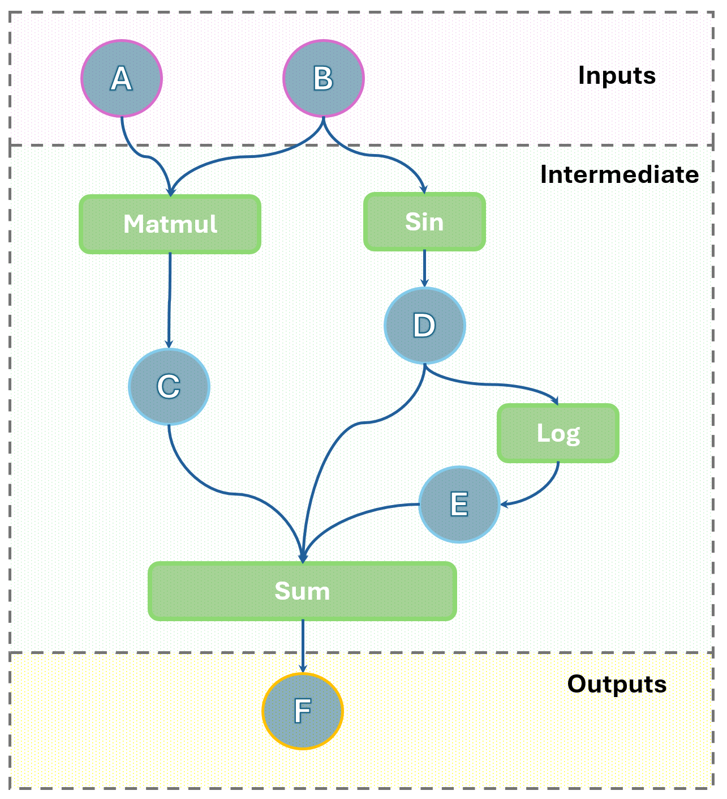
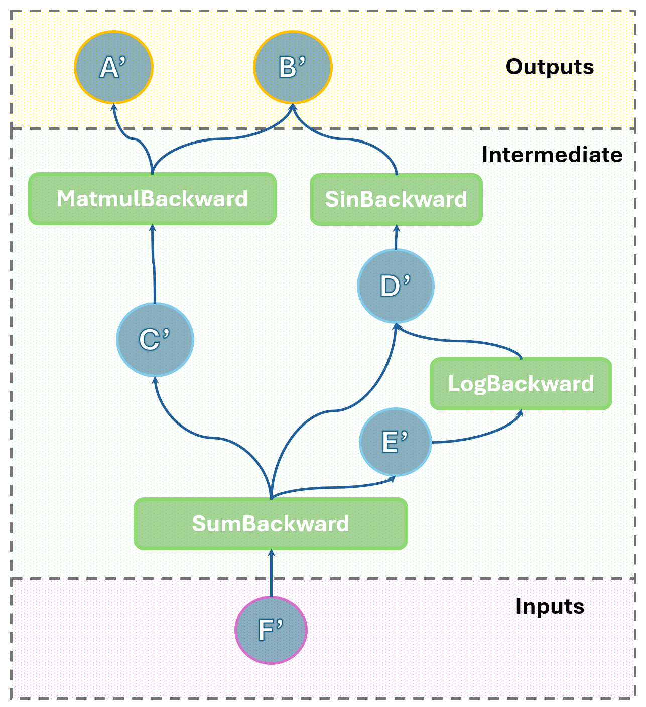
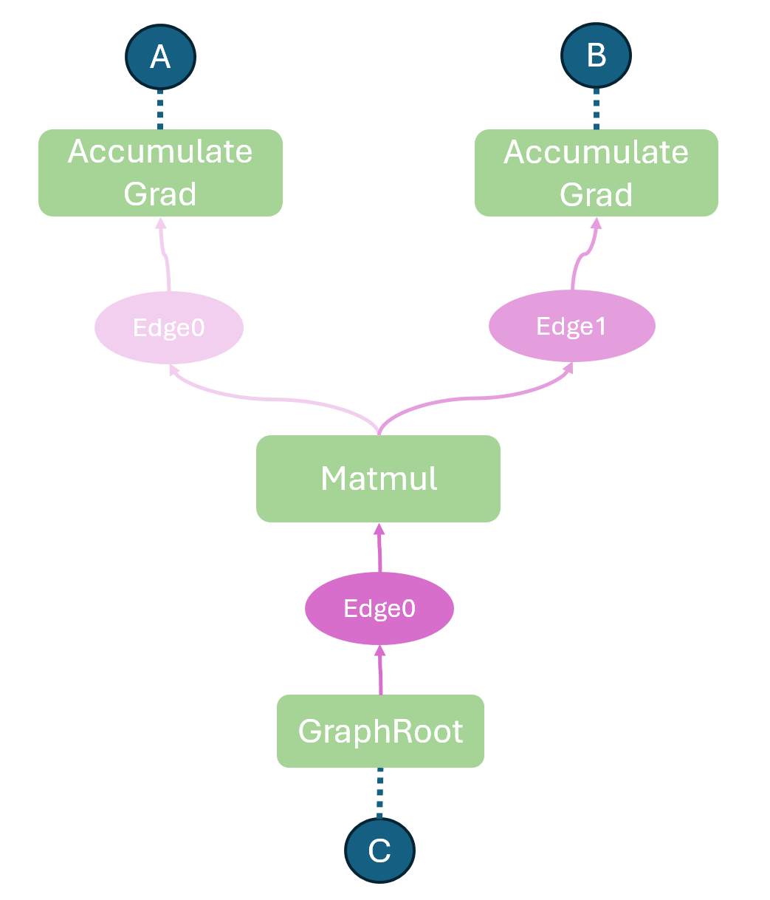
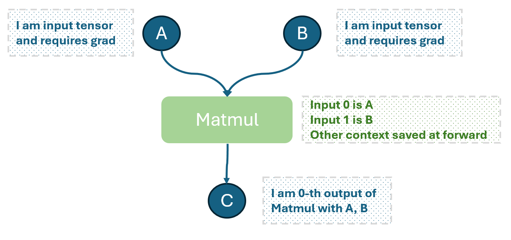

# Clownpiece-torch Week 2

This week, we'll focus on building an autograd engine. 

The term "autograd" stands for automatic differentiation. This powerful component is crucial for modern deep learning frameworks as it automates the complex process of gradient computation, freeing users from manually deriving and implementing backward passes.

A simple example in pytorch would be:
```python
import torch

# Create tensors with requires_grad=True to track computations
x = torch.tensor([2.0], requires_grad=True)
y = torch.tensor([3.0], requires_grad=True)

# Define a simple computation
z = x * y + y**2  # z = 2*3 + 3^2 = 6 + 9 = 15

# Backward pass: compute gradients of z w.r.t. x and y
z.backward()

# Print gradients
print(f"x.grad = {x.grad}")  # ∂z/∂x = y = 3.0
print(f"y.grad = {y.grad}")  # ∂z/∂y = x + 2*y = 2 + 6 = 8.0
```
Outputs:
```python
x.grad = tensor([3.])
y.grad = tensor([8.])
```


Feel ok if you find this feeling like magic. We will dive deeper into how autograd engine is implemented.

## Computation Graph

At the heart of an autograd engine lies the **computation graph**. This is a directed acyclic graph (DAG) that represents the sequence of operations performed.

*   **Nodes**: In this graph, nodes represent either tensors or operations.
      - Input nodes (with no inbound edges) are **input tensors**
      - The rest of nodes represent operations (abstracted as **function**)and their results (called **intermediate tensors**)
        - intermediate tensors have `require_grad=True` (grad is short for gradient)
        - some intermediate tensors have no outbound edges (no subsequent computation), then they are **output tensors**
*   **Edges**: Edges capture the dependencies between operations and tensors. They show how data flows from input tensors, through various operations, to produce output tensors.

For example, if you compute $c = a + b$, the graph would have nodes for input tensors $a$ and $b$, an operation node for addition ($+$), and a node for the resulting tensor $c$. Edges would connect $a$ and $b$ to the addition operation, and the addition operation to $c$.

Parameters used in computation are also considered input. For example, when you perform linear transform $y = W@x + \text{bias}$, all of $W, x, \text{bias}$ are considered inputs. ($@$ is matrix multiplication)

> Note: the computation graph is dynamically constructed and maintained, so that you may use conditional branch at forward pass.

## Function

Function is an abstraction of differentiable operations. It consists of two methods:

- $\text{forward}(\text{inputs}) \to \text{output}$: the operation to calculate the outputs at forward (i.e., the $f(x)$). There may be multiple inputs and outputs.
- $\text{backward}(\text{output\_grads}) \to \text{inputs\_grad}$: the function to calculate gradients during backward pass. It applies chain rules to derive inputs_grad from output_grads.

Data required to calculate inputs_grad can be saved at forward, and retrieved at backward. This is managed in a **context** object assoiated with each function call (two different call to the function create two contexts).

For example, the Function for $x \mapsto x^2$:

- $\text{forward}(x) \to x^2$, and $x$ is saved for backward.
- $\text{backward}(grad) \to grad*(2x)$, by applying the chain rule $[f(x^2)]' = f'(x^2)*(2x)$

Some activation functions, such as $\text{ReLU}$, are not differentiable at certain points (e.g., $x = 0$), but users can still define a custom backward function—for example, assigning a gradient of $0$ at the non-differentiable point.

Likewise, some transformations like $\text{Dropout}$ involve non-deterministic behavior (e.g., randomly zeroing outputs), but they can still be handled in a differentiable framework as long as we do not require gradients with respect to the underlying sampling distribution. In such cases, we treat the randomness as fixed (e.g. by saving which elements are zeroed out during forwrad) at backward pass and compute gradients only with respect to the deterministic path.


## Leaf Tensors

**Leaf tensors** are special nodes in the reversed (backward) computation graph, where backward flow stops.

There are two types of them:

1. All tensors with **does not requires grad**.
2. All **inputs tensors that requires grad**, as inputs are not created by any operations.

Again, taking linear transform $y=W@x+\text{bias}$ as example. 
- backward is called on $y$, and $y$ is not a leaf tensor. 
- $x$ is the input that does not require grad, so it's a type 1 leaf tensor.
- $W, \text{bias}$ are the parameters that typically require grad, so they are type 2 leaf tensors.


> Note: in pytorch, there is another attribute `retains_grad` related to grad accumulation. We will avoid that complexity, and only refer to `requires_grad`

## How the Autograd Engine Works
> **Forward Pass**

During the forward pass, data flows through the neural network (or any computational model), and operations are applied to input tensors to produce output tensors. As each operation is executed, the autograd engine meticulously records the details of these operations to construct a computation graph.

1. **Operation Recording**: Whenever a mathematical operation (e.g., addition, multiplication, convolution, activation function) is performed on one or more tensors, and at least one of these input tensors has been marked as requiring gradients (e.g., a model parameter), the autograd engine springs into action. It does not just compute the numerical result; it also registers the operation itself into computation graph.

2. **Computation Graph Creation**: For each registered operation, a "node" is created in the computation graph. This node encapsulates enough information to compute gradient at backward.

By the end of the forward pass, a complete computation graph has been constructed, representing the entire sequence of operations that transformed the input data into the final output as a DAG.

> **Backward Pass**

The backward pass, also known as backpropagation, is the process of computing the gradients of outputs tensors with respect to all the tensors in the computation graph that requires gradient. 

Formally, denote output tensors as $O_1, ..., O_n$, and their gradients $O_1', ... O_n'$, we compute the gradient for a tensor $w$:

$$
   w'= \frac{\partial O_1}{\partial w} * O_1' +  \frac{\partial O_2}{\partial w} * O_2' + ... + \frac{\partial O_n}{\partial w}*O_n'
$$

Typically, the output tensor is a single scalar loss value, denoted $L$, and its gradient is $1$. Then the gradient for a tensor $w$ is exactly $\frac{\partial L}{\partial w}$, which can be used for gradient descent.


1. **Initiation**: The backward pass starts from all output tensors , each with a given gradient (i.e., $O_i'$) specified by user. These output tensors are roots in the (reverse) computation graph.

2. **Graph Traversal (Reverse Topological Order)**: The engine traverses the computation graph in reverse order, moving towards the leaf tensors. This reverse traversal follows the topological order: for a given node, only when graidents of all its outputs have been calculated and accumulated into a buffer, can it be executed to obatin gradients of its inputs.

Conceptually, you may think that autograd engine constructs a **reverse computation graph** that represents backward pass, from information stored with forward computation graph, and executes that computation graph.

---

Let's consider an example:

```python
A: Tensor 2x2
B: Tensor 2x2

C = A@B
D = sin(B)
E = log(D)

F = C + D + E
```

The computation graph (from the view of forward pass) would look like:

<center>

</center>

It's corresponding backward computation graph would be:

<center>

</center>

Let's also have a look on backward functions:

- $\text{sum}: (x, y, z) \mapsto x+y+z$ backward function is simply $s' \mapsto (s', s', s')$. (when without broadcasting)

- $\log: x \mapsto \ln x$ backward function is $y' \to \dfrac {y'}{x}$


- $\sin: x \mapsto \sin x$ backward function is $y' \to \cos(x)y'$

- $\text{matmul}: (A, B) \mapsto A@B$ baclward function is $C' \mapsto (C'@B^T, A^T@C')$. 
    - This can be verified by expanding matrix multiplication to additions and multiplications.

---
## 📘 Additional Tutorials

Below are some tutorials that provide insights into how the autograd engine operates. You may find them helpful if any part of the mechanism is still unclear. Also feel free to skip you have understood  autograd well already.

Keep in mind that some terminology in these resources may differ from ours — for instance, in PyTorch's official documentation, “function” and “computation graph” typically refer only to the backward computation.

* [**PyTorch Autograd Mechanics (Official)**](https://pytorch.org/docs/stable/notes/autograd.html)
  Explains how PyTorch builds dynamic computation graphs and performs gradient computations.

* [**Autograd: Automatic Differentiation (PyTorch Official Tutorial)** ](https://pytorch.org/tutorials/beginner/blitz/autograd_tutorial.html)
  A beginner-friendly introduction to using `torch.autograd`.

* [**Understanding PyTorch Autograd – Complete Guide (Medium)**](https://medium.com/geekculture/understanding-pytorchs-autograd-a-complete-guide-240a07d4a4c6)
  Deep dive into autograd internals and how backward passes work.

* [**Understanding Autograd in PyTorch (DigitalOcean)**](https://www.digitalocean.com/community/tutorials/how-to-use-autograd-in-pytorch)
  Offers code walkthroughs for building and visualizing graphs in PyTorch.

* [**torchviz GitHub (Visualization Tool)**](https://github.com/szagoruyko/pytorchviz)
  Tool to visualize autograd graphs with examples.

---

# Code Guide

---

## Code Structure Overview

```bash
clownpiece
|--tensor
|--autograd
| |- autograd.py # Key Autograd Engine Component
| |- __init__.py
| |- function.py # Implement Functions
| |- no_grad.py  # Manage no_grad Context
|- __init__.py
|- tensor.py # TensorBase (w.o. grad tracing) and Tensor (w. grad tracing)
|...
```

---

* **`tensor.py`**:
  This file contains the `TensorBase` class that you implemented in Week 1. The `Tensor` class is a subclass of `TensorBase`. Currently, `Tensor` is functionally identical to `TensorBase`.

  In this week's task, you will extend the `Tensor` class to support gradient tracking and automatic differentiation. 

* **`autograd.py`**:
  This file contains key components for autograd engine that construct and execute the computation graph.

* **`no_grad.py`**
  This file manages the `no_grad` context that disable gradient tracing within the context. (Here, [context](https://www.geeksforgeeks.org/python/context-manager-in-python/) is a python concept, not the autograd concept!)
---

## How to test your code?

Similar to week1, go to `tests/week2/`, run `grade_part{i}.py` or `grade_all.py`

To see full traceback in debug mode, use `DEBUG=1 python grade_part{i}.py`.

---
### ! Important Note: Various Implements Possible

Clearly, there are many design decisions that vary slightly to implement autograd engine.

For example, with regards to backward execution, there are three ways:

- Construct backward computation graph directly at forward pass.
- Construct the complete forward computation graph, then execute backward on forward computation graph.
- Construct the complete forward computation graph, then construct the backward computation graph, finally execute it.

With regards to computation graph representation:

- Only functions are nodes, tensors (inputs and outputs of a function) are attached to the function;   
  - edges connect functions, with an additonal `input_nr` field recording which output tensor it relates to.

- Both functions and tensors are nodes; 
  - edges connect function and tensor

**In the following code guide, we will stick to the same design as PyTorch:**

- Consruct backward computation graph directly at forward pass.

- Only functions are nodes. (Sorry, this differs from what we have covered as the conceptual computation graph, but this is easier to implement.)

In the following disscussion, all computation graphs refers to the backward graph, inputs refer to the output_grads, outputs refer to the input_grads. (unless otherwise specified)

We will give a visulaziation and explanation of only-functions-are-node backward graph after introducing Node, Edges, and Functions.

---

## Part 0: Autograd Core

> expected LOC: ~300

First, go to `autograd/no_grad.py`, we have written the `no_grad` context manager, and `is_grad_enabled` method for you.

```python 
def is_grad_enabled():
    """Returns whether gradient tracking are currently enabled."""
    return _grad_enabled

@contextmanager
def no_grad():
    """
    Context-manager that disables gradient calculation.
    
    Within this context, gradients will not be calculated, and `requires_grad` flags
    will be ignored. This can be used to improve performance when you don't need
    gradients, such as during inference.
    
    Example:
        ```python
        with no_grad():
            # Computations here don't track gradients
            result = model(input_data)
        ```
    """
    global _grad_enabled
    previous = _grad_enabled
    _grad_enabled = False
    try:
        yield
    finally:
        _grad_enabled = previous

```

Please add `no_grad` and `is_grad_enabled` to `autograd/__init__.py`, so we can import it from autograd module.

```python
# autograd/__init__.py
from .no_grad import no_grad, is_grad_enabled

__all__ = [
  "no_grad", "is_grad_enabled"
]
```
>> Hint: in the following tutorial, we will not explicit instruct you to modify `__init__.py`. Please add classes/methods you want to export to `__init__.py` as needed. Some classes/methods must be accessible to pass graderlib, and we will remind you of that.

Let's begin by populating new fields in `Tensor` class to support grad tracing:

```python
# tensor/tensor.py
from typing import Optional
from clownpiece.autograd import is_grad_enabled

class Tensor(TensorBase):
  # if grad tracing should be enabled for this tensor
  requires_grad: bool

  # grad of the Tensor, possibly None
  grad: Optional["Tensor"] 
  
  # function instance that produces the Tensor, possibly None
  grad_fn: Optional["Function"] 
  # this tensor is the i-th output of grad_fn's forward. In the backward graph, it becomes input_nr of the edge.  
  output_nr: int

  def __init__(self, data: TensorBase, requires_grad: bool = None) -> "Tensor":
    super().__init__(data)
    self.requires_grad_(requires_grad)

  # set requires_grad based on is_grad_enabled.
  # ! you must implement this method: grader lib uses this function
  def requires_grad_(self, requires_grad: bool = None):
    if requires_grad is None:
      requires_grad = is_grad_enabled()
    
    self.requires_grad = requires_grad and is_grad_enabled()
```

>> Hint: we use "Tensor" instead of Tensor for type annotation because this class is incomplete inside itself! Python has support for type checking with quotes. This trick can also be applied to avoid cyclic import while preserving type checking.

---

Now, we will give a walkthrough of `autograd/autograd.py` and `autograd/function.py` about how is the computation graph represented.

```python
# autograd/autograd.py
class Node():
    node_id: int
    next_edges: List["Edge"]

    def __init__(self):
        self.node_id = None
        self.next_edges = []
        
    def run(self, *args, **kargs):
        raise NotImplementedError("run method not implemented for abstract Node instance")
    
    # define __hash__ and __eq__ to use Node as dict's key
    def __hash__(self):
        return hash(self.node_id)
    
    def __eq__(self, other):
        if not isinstance(other, Node):
            return False
        return self.node_id == other.node_id

class Edge():

    input_nr: int # the Edge points to the i-th input of target Node
    node: Optional[Node] # target node the Edge points to

    def __init__(self, input_nr: int, node: Optional[Node]):
        self.input_nr = input_nr
        self.node = node
    
    @staticmethod
    def gradient_edge(tensor: Tensor) -> "Edge":
      # your implement here

      # case 1: tensor is not a leaf tensor -> use it's grad_fn and output_nr

      # case 2: tensor is a leaf tensor and requires grad -> AccumulateGrad Function

      # case 3: tensor is a leaf tensor and requires no grad -> node = None
      pass
```

The `Node` and `Edge` classes are defined in `autograd/autograd.py`. They refers to the nodes and edges in the backward graph. You need to complete `Edge.gradient_edge` method.

```python
# autograd/function.py

class Function(Node):
    """
    Base class for all functions.
    """
    ctx: Context
    
    def __init__(self):
        super().__init__()
        self.ctx = None
        
    @staticmethod
    def forward(ctx: Context, *args):
        raise NotImplementedError("Forward method not implemented")

    @staticmethod
    def backward(ctx: Context, *args):
        raise NotImplementedError("Backward method not implemented")    
    
    # run forward pass
    def apply(self, *args, **kwargs):
      # your implement here

      # step 1. initialize self.ctx and populate self.next_edges

      # step 2. outputs = self.forward(...) with no_grad

      # step 3. set grad_fn for outputs to self

      # step 4. return outputs

      pass
    
    # run backward pass
    def run(self, *args):
      # your implement here

      # step 1. grad_inputs = self.backward(...) with no_grad

      # step 2. return grad_inputs
      pass
```

`autograd/function.py` contains `Function` class, which is a subclass of `Node`. 

Its `run` method execute the backward pass in the computation graph, while its `apply` method is a wrapper around forward pass and record meta information for backward graph construction. You need to implement `run` and `apply` method.

All of your custom functions should subclass `Function`, and implement their respective static `forward` and `backward` method.

Below are two special nodes, that wraps around inputs tensor and outputs tensor in the foward computation graph:

```python
# autograd/function.py
class AccumulateGrad(Function):
    """
    Accumulate gradient to .grad field
    
    grad_fn for leaf tensors
    """
    def __init__(self, input: Tensor):
      # your implement here

      pass
    
    # this forward should never be called
    @staticmethod
    def forward(ctx: Context):
        return None
    
    @staticmethod
    def backward(ctx: Context, output_grad: Tensor):
      # your implement here
      
      pass

# autograd/autograd.py
class GraphRoot(Node):
    """
    Root node in the computation graph.
    """

    def __init__(self, tensor: Tensor, grad: Tensor):
      # your implement here

      # step1. store the grad
      # step2. create a single edge points to tensor.grad_fn
      pass
    
    def run(self, *args, **kargs):
      # your implement here

      # step1. return the stored grad
      pass
```

With these two special Nodes, we can give a concrete example of backward graph in our implement.

```python
A: Tensor 2x2
B: Tensor 2x2

C = A@B
```

<center>

</center>

And the meta data recorded during forward would be like

<center>

</center>


---

## How to construct the backward graph?

**At forward**:
  when a `Function.apply()` is called
  - the Function's `next_edges` are created using their inputs' `grad_fn` and `output_nr`. If input is a leaf tensor that requires grad, then the edge points to `AccumulateGrad`.

  - the outputs' `grad_fn` and `output_nr` is set after `forward` call.

**At backward**:
  when `backward()` is called with output tensors and their gradients
  - a `GraphRoot` is created for each output, with a single edge pointing to the its real `grad_fn`.

  At adding graph roots, backward graph is now complete, and can be executed.

Please complete `Node / Edge / Function / AccumulateGrad / GraphRoot` before proceeding.

## How to execute the backward graph?

This is as simple as runing topological sort on the backward graph with a buffer to accumulate intermediate results. Essentially, that's all about it, but good engineering practice usually requires a bit more abstraction.

We add another layer of abstraction `NodeTask` and `GraphTask` to better support parallelism.

```python
# autograd/autograd.py
class NodeTask():
    """
    NodeTask wraps a Node and all its input. 
    It's a ready-to-run Node in GraphTask.
    """

    base: "GraphTask"
    node: Node
    inputs: List[Tensor]
    
    def __init__(self, node: Node, inputs: List[Tensor], base: "GraphTask"):
        self.base = base
        self.node = node
        self.inputs = inputs
        
    def run(self):
        # your implement here

        # step1. run the node with inputs

        # step2. fill the input buffer in GraphTask
        pass


class GraphTask():
    
    """
    GraphTask wraps the execution of a computation graph.
    """
    
    roots: List[Node] # GraphRoots instances
    nodes: List[Node] # all nodes in the computation graph
    dependencies: Dict[Node, int] # count of inbound degree for topological sort
    inputs_buffer: Dict[Node, List[Tensor]] # inputs_buffer to accumulate intermediate results.
    
    def __init__(self, roots: List[Node]):
        roots = wrap_tuple(roots)
        roots = [root for root in roots if root is not None]
        
        if not roots:
            raise ValueError("roots is empty")
    
        self.roots = roots
        self.nodes = []
        self.dependencies = {}
        self.inputs_buffer = {}
        self._construct_graph()
        
    # helper function to assign node_id and initialize self.nodes, dependencies and inputs_buffer
    def _construct_graph(self):
        # your implement here
        pass
        
    # execute
    def run(self):
        # your implement here
        pass

    # for debug
    def _run_single_thread(self):
        # your implement here

        # perform topological sort to execute the graph

        # while queue is not empty:
        # 1. node_task = queue.pop()
        # 2. node_task.run()
        # 3. decrement dependencies count for target nodes of outbound edges
        # 4. enqueue a new NodeTask if dependencies drops to zero. (remember to delete the node in inputs_buffer to release memory.)
        pass

    # for production
    def _run_multi_thread(self):
        # your implement here

        # step1. maintain a shared ready queue for NodeTasks

        # step2. def a worker function, similar to _run_single_thread.
        # be careful: do not use `while queue is not empty` as exit condition directly. (why?)

        # step3. spawn multiple worker threads.

        # step4. wait for threads to join.
        pass
                    
    # accumulate input_grad to self.inputs_buffer[node][input_nr]
    def fill_input(self, node: Node, input_grad: Tensor, input_nr: int):
        # your implement here

        pass
```

> **Why we cannot use `while queue is not empty` as exit condition directly in multithreading case?**
 Give explanation in your report

> **Why multithreading in backward  execution matters, even if there is operator level multithreading?**
  Give explanation in your report

The comments in `NodeTask` and `GraphTask` should be sufficient to guide you through. After completing these, the `backward` call is straightforward.

```python
# autograd/autograd.py

def backward(tensors: Union[Tensor, List[Tensor]], grads: Optional[Union[Tensor, List[Tensor]]] = None):
    tensors = wrap_tuple(tensors)

    if grads is None:
        grads = [ones_like(tensor) for tensor in tensors]
    grads = wrap_tuple(grads)
    
    # wrap with GraphRoots
    graph_roots = [
        GraphRoot(tensor, grad) for tensor, grad in zip(tensors, grads) if tensor.requires_grad
    ]

    # execute with GraphTask
    gt = GraphTask(graph_roots)
    gt.run()
```

>> Note: we provide default `ones_like` tensors as gradient. While in PyTorch, it is only allowed to provide $1$ for a scalar valued tensor. This behavior differs from ours.

We also bind a backward method in `Tensor` class using this backward function.
```python
class Tensor(TensorBase):

  def backward(self, grad: Optional["Tensor"]=None):
    from clownpiece.autograd.autograd import backward
    backward(self, grad)
```

Unforunately, up to this point, it is impossible to test your code, as you haven't written any concrete function for `Tensor`. Move on for now, and fix bugs in part 0 in the future.

---

## Part 1 Clone/Contiguous/Subscriptor

We first introduce how to bind `Function` with `Tensor` method, taking `Clone` as example, the `Tensor.clone()` should have two branches:

```python
# autograd/function.py
class Clone(Function):
    @staticmethod
    def forward(ctx: Context, input: Tensor):
        return input.clone()
    
    @staticmethod
    def backward(ctx: Context, grad_output: Tensor):
        return grad_output
```


```python
# tensor/tensor.py

# if grad should be traced for given args 
# (any of args requires grad, and grad tracing is globally enabled)
def is_grad_enabled_with_params(*args):
  flatten_args = []
  for arg in args:
    if isinstance(arg, (list, tuple)):
      flatten_args.extend(arg)
    else:
      flatten_args.append(arg)  
  return is_grad_enabled() and any(tensor.requires_grad for tensor in flatten_args if isinstance(tensor, Tensor))


class Tensor(TensorBase):
  def clone(self) -> "Tensor":
    if is_grad_enabled_with_params(self): 
      # grad tracing enabled
      from clownpiece.autograd.function import Clone
      return Clone().apply(self)
    else: 
      # grad tracing disabled, perhaps inside the Clone.forward.
      return Tensor(TensorBase.clone(self), requires_grad = False)
```
> **Why locally import `Clone` from `clownpiece.autograd.function`?** This is to avoid cyclic import issue. Unlike C/C++, it's tricky to separate Python header with implement, and in many cases cyclic import is inevitable. An easy solution is to import just in time.


The call to `Tensor.clone` flows like:
```python
-Tensor.clone(self) # w. grad tracing
|-Clone().apply(self)
  |-Clone().forward(ctx, self)
    |-Tensor.clone(self) # w.o. grad tracing
      |- TensorBase.clone(self)
```

Clearly, we can see a common pattern: every Tensor method that supports gradient tracing must handle two branches — whether tracing is enabled or not. 

To avoid repeating this logic in every method, we can introduce a **decorator** that automatically dispatches the method to a Function class when gradient tracking is required.

A decorator is a *function of function*, it takes in a function, wrap it with some logic, then return the wrapped function.

[This link](https://www.geeksforgeeks.org/decorators-in-python/) provides a more detailed tutorial of python decorators.

**We have implemented this decorator for you**; this decorator is well-tested with std, and can wrap all gradient tracing methods covered in our project.
```python
class Tensor(TensorBase):

  """
    Wrap around a Tensor operator that traces gradient.
    @arg: op_name: the name of the TensorBase method to call.
    @arg: Function_name: the name of the Function class to use for autograd.
  """
  @staticmethod
  def tensor_op(op_name, Function_name):
    def decorator(function):
      def wrapped_function(*args, **kwargs):
      
        if not is_grad_enabled_with_params(*args):
          op = getattr(TensorBase, op_name)
          raw_results = op(*args, **kwargs)
          
          def TensorBase2Tensor(x):
            return Tensor(x, requires_grad=False) if isinstance(x, TensorBase) else x
          
          if isinstance(raw_results, (list, tuple)):
            return tuple(TensorBase2Tensor(x) for x in raw_results)
          else:
            return TensorBase2Tensor(raw_results)
        
        module = importlib.import_module("clownpiece.autograd.function")
        FunctionClass = getattr(module, Function_name)

        return function(*args, **kwargs, FunctionClass=FunctionClass)
      
      return wrapped_function
    return decorator      
```
>> Make sure you understand this decorator beforing using it!

The `Tensor.clone()` can be simplified to:

```python
  @tensor_op('clone', 'Clone')
  def clone(self, FunctionClass=None)->"Tensor":
    return FunctionClass().apply(self)
```

where `name='clone'` specifies the method to call in `TensorBase` class; `Function_name='Clone'` automatically imports the `Clone`, and feed it to `FunctionClass` as keyword argument.

>> Keep this coding trick in mind: if several functions share similar logic, try to use a decorator. This saves a lot of repeating codes.

---

Following the `Tensor.clone` example, please complete:

> `def Tensor.clone(self) -> "Tensor"` & `class Clone(Function)`

> `def Tensor.contiguous(self) -> "Tensor"` & `class Contiguous(Function)`

From data's perspective, `clone` and `contiguous` are essentially identical mapping, so their backward is also identical mapping.

You should NOT copy grad_fn field in clone or contiguous. This will break the integrity of computation graph. Remeber, all operations on tensors are internally tracked by the computation graph.

> `def Tensor.__getitem__(self, index_or_slice) -> "Tensor"` & `class Subscriptor(Function)`

Subscriptor returns a view of the tensor (or sub-tensor). The backward need to:

- 1. create `grad_input = zeros(input_shape)`
- 2. subscript `sub_grad_input = grad_input[index_or_slice]`
- 3. copy `grad_output` into `sub_grad_input` using `copy_`.

>> Remark: inplace modifications on a subsscriptor-returned tensor are prohibited when grad tracing is enabled. You need not support them.

>> One may only use subscriptor to create a new tensor when grad tracing is enabled.

---

## Part 2. Unary Operations

Elementwise unary operations' backward is as simple as computing their derivatives. Given $y=f(x)$ and $\frac{\partial L}{\partial y}$, compute 
$$
  \frac{\partial L}{\partial x} = \frac{\partial y}{\partial x} \frac{\partial L}{\partial y} = f'(x) \frac{\partial L}{\partial y}
$$

However, different from conventional differentiation you are familiar with in calculus, we often utilize saved forward context to make the backward pass more efficient (with variable substitution).

For example, consider the hyperbolic tangent function:

$$
y = \tanh(x)
$$

Its derivative is:

$$
\frac{dy}{dx} = 1 - \tanh^2(x)
$$

Instead of recomputing $\tanh(x)$ during the backward pass, we can reuse the output $y$ from the forward pass:

$$
\frac{dy}{dx} = 1 - y^2
$$

This reuse of forward values is common in autograd systems and improves performance while maintaining numerical stability.

Please complete

> `Tensor.__neg__(self)` & `class Neg(Function)`

  Element-wise negation of a tensor. If $y = -x$, then $\frac{dy}{dx} = -1$. 

> `Tensor.sign(self)` & `class Sign(Function)`

  Element-wise sign function. The derivative of $\text{sign}(x)$ is $0$ for $x \neq 0$ and undefined at $x=0$. For autograd purposes, the gradient at $x=0$ is typically taken as $0$.

> `Tensor.abs(self)` & `class Abs(Function)`

  Element-wise absolute value. If $y = |x|$, then $\frac{dy}{dx} = \text{sign}(x)$. The gradient at $x=0$ is often taken as $0$.

> `Tensor.sin(self)` & `class Sin(Function)`

  Element-wise sine function. If $y = \sin(x)$, then $\frac{dy}{dx} = \cos(x)$.

> `Tensor.cos(self)` & `class Cos(Function)`

  Element-wise cosine function. If $y = \cos(x)$, then $\frac{dy}{dx} = -\sin(x)$.

> `Tensor.tanh(self)` & `class Tanh(Function)`

  Element-wise hyperbolic tangent. As discussed, if $y = \tanh(x)$, then $\frac{dy}{dx} = 1 - \tanh^2(x) = 1 - y^2$.

> `Tensor.clamp(self, min_val, max_val)` & `class Clamp(Function)`

  Element-wise clamp function. If $y = \text{clamp}(x, \text{min\_val}, \text{max\_val})$, the gradient $\frac{\partial L}{\partial x}$ is $\frac{\partial L}{\partial y}$ if $\text{min\_val} < x < \text{max\_val}$, and $0$ otherwise.

> `Tensor.log(self)` & `class Log(Function)`

  Element-wise natural logarithm. If $y = \ln(x)$, then $\frac{dy}{dx} = \frac{1}{x}$.

> `Tensor.exp(self)` & `class Exp(Function)`

  Element-wise exponential function. If $y = e^x$, then $\frac{dy}{dx} = e^x = y$.

> `Tensor.pow(self, exponent)` & `class Pow(Function)`

  Implements element-wise power function $y = x^{\text{exponent}}$. Then $\frac{dy}{dx} = \text{exponent} \cdot x^{\text{exponent}-1}$. 
> `Tensor.sqrt(self)` & `class Sqrt(Function)`

  Element-wise square root. If $y = \sqrt{x}$, then $\frac{dy}{dx} = \frac{1}{2\sqrt{x}} = \frac{1}{2y}$.


---

## Part 3. Add, Subtract, Mult, Div

Elementwise backward for these elementary functions are trivial. The key challenge is to handle broadcasting.

What is the backward of broadcasting? 

- Broadcasting is replicating along certain dimentions. 
- The backward of replicating is to sum gradient together. 
- So the backward of broadcasting is to sum along dimentions that are broadcasted (and sequeeze padded dimentions if any.)

You can write two decorators, that wrap forward and backward respectively for Add, Subtract, Mul, Div

```python
# backward method for broadcast
def reduce_broadcast(grad_output: Tensor, input_shape: List[int], output_shape: List[int], end_dim: int = 0) -> Tensor:
  # end_dim argument is for matmul, which only broadcasts dim <= dim() - 2
  pass

# binary op forward decorator
def binary_op_forward_wrapper(forward_impl):
  # save input shapes into ctx
  # call forward_impl
  pass

# binary op backward decorator
def binary_op_backward_wrapper(backward_impl):
  # call backward_impl to get grad_inputs_broadcasted
  # call reduce_broadcast to get grad_inputs
  pass
```

Besides, you must support upcasting a scalar to singleton Tensor for +-*/. This can also be done by adding a decorator `scalar_args_to_tensor`. (you may assume scalar is either int or float).

Please complete:

> `Tensor.__add__(self, other)` & `Tensor.__radd__(self, other)` & `class Add(Function)`

  Note that in `__radd__`, self is RHS, other is LHS.

> `Tensor.__sub__(self, other)` & `Tensor.__rsub__(self, other)` & `class Sub(Function)`

> `Tensor.__mul__(self, other)` & `Tensor.__rmul__(self, other)` & `class Mul(Function)`

> `Tensor.__truediv__(self, other)` & `Tensor.__rtruediv__(self, other)` & `class Div(Function)`

Divided by zeros results in NaN, but this should not raise exception. Any operation involving NaN is not differentiable.

Usually NaN does not need special treatment, as any operation NaN participates in results in another NaN.

---

## Part 4. Matmul

Considering a conventional 2D * 2D matrix: $C=A@B$

$$
  C_{i,j} = \sum_k {A_{i,k} * B_{k, j}}
$$

Then 
$$
\begin{aligned}
  \dfrac{\partial C_{k,l}}{\partial A_{i,j}} &= [i=k] * B_{j, l} \\
  \Rightarrow \dfrac{\partial L}{\partial A_{i, j}} &= \sum_{k, l} \dfrac{\partial L}{\partial C_{k, l}} \dfrac{\partial C_{k, l}}{\partial A_{i, j}} = \sum_{l} \dfrac{\partial L}{\partial C_{i, l}} B_{j, l} \\
  &= \sum_{l} C'_{i, l} * B^T_{l, j} \\
  \Rightarrow A'&=C'@B^T
\end{aligned}
$$

Similarily, we can show that $$B' = A^T@C'$$

Another challenge for Matmul is properly handling various shaping cases of inputs.

Recall that the shaping rules for matmul is
- if both operands are 1-D, a dot product 0-D scalar tensor is returned
- if lhs is 1D, while rhs is at least 2-D, then a 1 is padded to the lhs' dimensions to make it 2-D. The padded dimension is removed at return.
- if rhs is 1D, while lhs has at least 2-D, then a 1 is padded to the rhs' dimensions to make it 2-D, and then rhs is transposed. The padded dimension is removed at return.
- if both operands are at least 2-D, then last 2 dimensions are treated as matrix dimension, and remaining leading dimensions are broadcasted.
  - for example, $L=(i\times 1 \times n \times m), R = (j \times m \times l)$, then return will be $(i \times j \times n \times l)$.

Your backward implementation must correctly handle padding of grad_output and reduction across broadcasted dimensions to match the original operand shapes. All cases will be tested.

Please complete:

> `Tensor.__matmul__(self, other)` & `Tensor.__rmatmul__(self, other)` & `class Matmul(Function)`

Note that matmul with scalar is prohibited. (so whether to reload `__rmatmul__` in fact does not matter.)

---

## Part 5. Sum/Max/Softmax

Pleaes complete:

> `Tensor.sum(self, dim=None, keepdims=False)` & `class Sum(Function)`

Broadcast at backward to expand the reduced dimention.

> `Tensor.max(self, dim=-1, keepdims=False)` & `class Max(Function)`

Max is a differentiable operation (with weak assumption that when elements are equal, we deterministically choose first one). 

The backward of Max is to
- create $\text{grad\_input} = \text{zeros}(\text{input\_shape})$
- scatter $\text{grad\_output}$ along the dimention with index $\text{argmax}$ into $\text{grad\_input}$.  (use `scatter_` method).

You may think that only the max element affects downstream computation, and therefore, the gradient should be populated to where the max element is (i.e. argmax).

> `Tensor.softmax(self, dim=-1)` & `class Softmax(Function)`

Recall that softmax function over a tensor $\mathbf{x} \in \mathbb{R}^n$ along a given dimension is defined as:

$$
y_i = \frac{e^{x_i}}{\sum_{j} e^{x_j}}
$$

Let $\mathbf{y} = \mathrm{softmax}(\mathbf{x})$, and let $\mathbf{g} = \frac{\partial L}{\partial \mathbf{y}}$ be the gradient flowing from downstream. We want to compute $\frac{\partial L}{\partial \mathbf{x}}$.


$$
\frac{\partial y_i}{\partial x_j} = y_i (\delta_{ij} - y_j)
$$

Using the chain rule:

$$
\frac{\partial L}{\partial x_i} = \sum_{j} \frac{\partial L}{\partial y_j} \cdot \frac{\partial y_j}{\partial x_i}
= \sum_{j} g_j \cdot y_j (\delta_{ij} - y_i)
$$

$$
\Rightarrow \frac{\partial L}{\partial x_i} = y_i \left( g_i - \sum_{j} g_j y_j \right)
$$

In vector form:

$$
\frac{\partial L}{\partial \mathbf{x}} = \mathbf{y} \cdot \left( \mathbf{g} - \lang\mathbf{g}, \mathbf{y}\rang \right)
$$


## Part 6. Shape Manipulation

A golden rule to understand the derivative of shape manipulation is:
> Thinking forward as moving data around guided by a mapping, then backward is exactly the reverse: moving gradient around guided by the **reverse mapping**.

For example: 
- `permute()` is moving data around by reordering axes, then its backward should reorder axes back.

- `sequeeze()` is mapping data from $d$-dimention index space into $(d-1)$-dimention index space. Since the sequeezed dimention must have size $1$, the mapping is bijective, and therefore differentiable.

- `narrow()` maps data into a subspace along a specific axis and index range.
  - The data within the index range are mapped bijectively to the output; their relative positions are preserved.
  - The data outside the range are mapped into the void—they no longer influence downstream computation-and thus receive zero gradient during backward.

>> Be careful to handle inputs or outpus in list format! You may need to use `*args` and `return *tensors` to avoid breaking autograd engine's `input_nr` logic.

Please complete:

> `Tensor.permute(self, perm)` & `class Permute(Function)`

> `Tensor.transpose(self, dim0=-1, dim1=-2)` & `class Transpose(Function)`

> `Tensor.reshape(self, shape)` & `class Reshape(Function)`

> `Tensor.view(self, shape)` & `class View(Function)`

> `Tensor.narrow(self, dim, start, length)` & `class Narrow(Function)`

> `Tensor.chunk(self, chunks, dim)` & `class Chunk(Function)`

> `Tensor.split(self, split_size_or_sections, dim)` & `class Split(Function)`

> `stack(tensors, dim)` & `class Stack(Function)`

> `cat(tensors, dim)` & `class Cat(Function)`

> `Tensor.squeeze(self, dim=-1)` & `class Squeeze(Function)`

> `Tensor.unsqueeze(self, dim=-1)` & `class Unsqueeze(Function)`

> `Tensor.broadcast_to(self, shape)` & `class BroadcastTo(Function)`

> `broadcast(tensors)` & `class Broadcast(Function)`

---

### Part UNKOWN

Due to the same reason as week1, please complete:

> `Tensor.mean(self, dim, keepdims=False)` & `class Mean(Function)`

> `Tensor.var(self, dim, keepdims=False, unbiased=True)` & `class Var(Function)`

Think carefully for backward of Var.

Tests are included in part5 (initially commented out).

---

## Submit Your Homework

First, make sure that you passed the `grade_all.py`.

Then, you should write a detailed **report** under `docs/week2`, to describe the challenges you have encountered, how did you solved them, and what are the takeaways. (Also, attach the grader summary part from output of `grade_all.py`). This report accounts for part of your score.

There is no optional challenge for week2, but if you complete week1'
s OC, you may include it in this week's report.

Finally zip the entire project folder into lab-week2.zip, and submit to canvas.

Make sure that the TAs can run the `grade_all.py` and find your report from your submission.